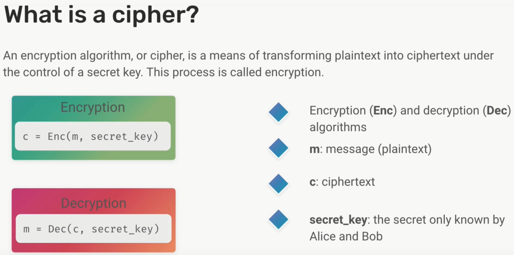

# Cryptography basics

## Ciphers = encryption and decryption algorithms

This is an example of symmetric encryption:

**A cipher is an algorithm that allows to encode and decode information. 
Encryption - Encoding  
Decryption - Decoding    
Encrypted message - ciphertext    
Not encrypted message - plaintext**

#### Simplest cipher: Shift cipher
The Caesar's cipher was a shift cipher, it is a type of substitution cipher (Characters of a message are substituted by another),. The Caesar's cipher substitutes each letter of the message by a shift of 3 letters in the alphabet. 
Trivially crackable.

Sender and receiver agree on a secret key (Number of shifts). The secret key is only known to them. 

#### Mono alphabetic cipher: We substitute each letter of the alphabet for one of the random letters from the remaining set

#### Vignère cipher: The secret key is of arbitrary length. A letter could be shifted in different ways as well. 

