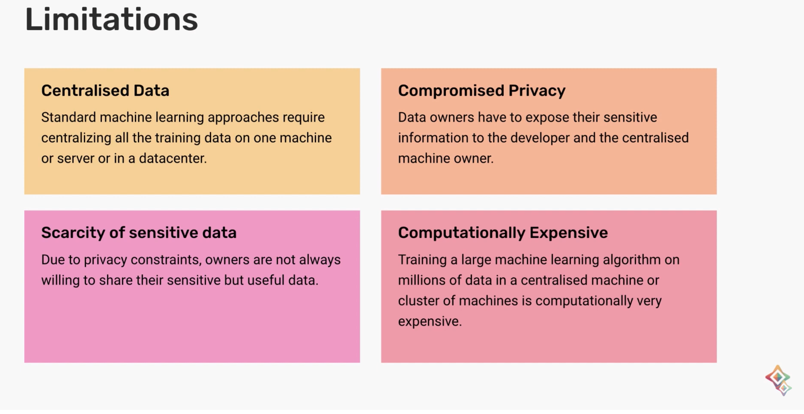
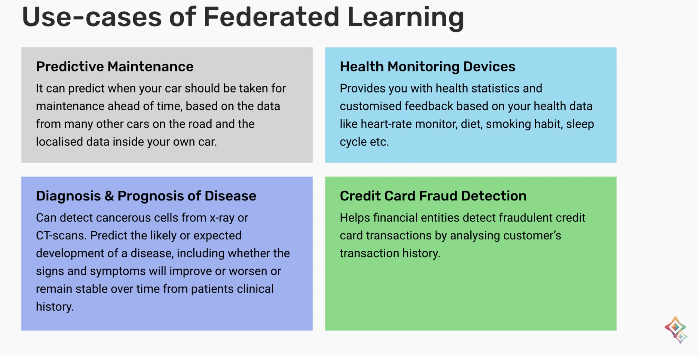
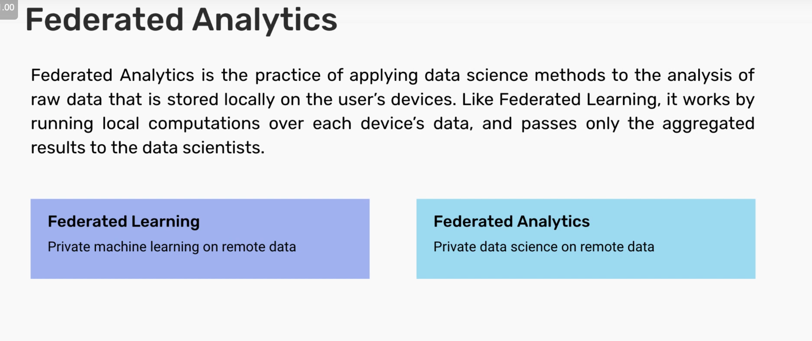

# Federated Learning (FL)

## Limitations

## Definitions 
FL is a set-up for training ML algorithms on data without the owner having to share, transfer, or expose their data with the developer and the service provider.

Two types:
1. Cross-device FL (Laptops, phones, IoT devices in general)
2. Cross-silo FL (Databases from institutions like hospitals, banks, etc.)

## Advantages of FL

1. Data never leaves the owner's device
2. Privacy of sensitive data is preserved
3. Data owners get more comfortable with sharing their data, hence better AI models
4. Computationally cheaper (Perhaps for the service provider, but not with all the phones in aggregate, overhead increases)
5. Improved latency (Avoid uploading datasets to the cloud), better battery life
6. Works offline 

It is one of the fastest PETs being adopted.

FL drawback:

Small number of model parameters

While we have access to more data under federated learning, it doesn't lower the number of parameters required to reach a certain performance. In fact, with access to more data, you might use larger models that are able to capture more information.

## Use cases

Wearables, predictive maintenance of vehicles, cell phones, web browsers

## Federated analytics

Cool idea - do FL on a P2P network
