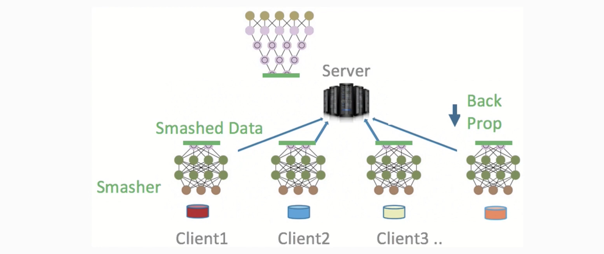
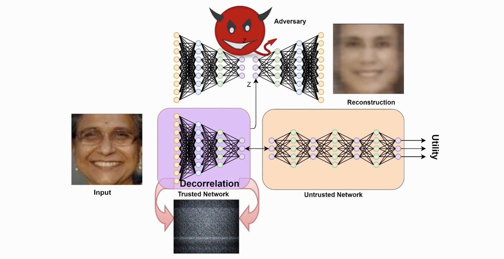
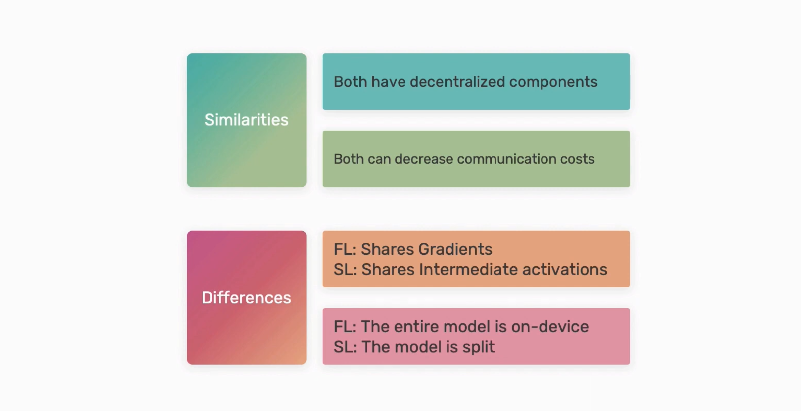

# Split Learning (SL)

Split the deep neural network (DNN) into multiple parts and send one of these parts to where the data is, the device.
Instead of sending the gradients to a central server after training locally, we send instead the output obtained from parsing the data through the split of the NN sent to the device.
SL is suitable when the data is vertically distributed, where the labels are not with the data owners.

"""
Split learning refers to the process of cutting a Deep Neural Network (DNN) into two or more sections and deploying the first section on-device (e.g. a client's smart-phone) and the second section on the server. In this setting, intermediate activations from the chosen cutting point layer (called split layer) of the DNN are communicated from the client to the server during training. The rest of the network is processed at the server during forward propagation.

In turn, during backpropagation, the gradients from the server’s first layer (layer next to the split layer) are communicated back to the client. The rest of the backpropagation occurs at the client. These rounds of communication are continued to finish all the epochs of distributed training (NoPeek and split-nn for health).

Federated learning and split learning share the same goal, which is to avoid sending raw user data to untrusted third parties. However, the method in which they approach this goal is different: federated learning does so by sending only the gradient updates to the server, whereas split learning achieves this by sending the intermediate activations from the split layer, which is an abstracted representation of the input. This is the most important difference between these two schemes.
"""

You do not share the raw data, but a compressed version of it.

## Fundamentals

### Self-Information (Information content)

I(.) - Informmation content 
X - random variable (r.v.)
x - event observed from the possible events of X
I(x) = - log_2 (P(x))

[Wikipedia article](https://en.wikipedia.org/wiki/Information_content)

### Entropy

Quantifies the amount of information there is in a single r.v. Measures "uncertainty".

H(X) = - sum_(from n with i = 1) (P(x_i)log(P(x_i))) = E[-log_2 P(X)] = E[I(X)]

[Wikipedia article](https://en.wikipedia.org/wiki/Entropy_(information_theory))

### Mutual Information

It is calculated between 2 r.v.'s and measures the reduction in uncertainty for one variable given a known value of the other variable.
If there is a lot of mutual information between the shared activations and the raw input, then I can make inferences from the activations to reconstruct the raw input. If there is little shared information, then mutual information is also low. 

Minimize I(X;Y), the mutual information

[Mutual information](https://en.wikipedia.org/wiki/Mutual_information)

## Vertically distributed learning

### Horizontally distributed data

Inputs and labels are in a different machine to where the machine learning algorithm is originally stored.
The data owner has these inputs and labels, while the data scientist has the model.
Federated learning (FL) solves this problem.

### Vertically distributed data

Where the labels and the input are in different locations governed by different data owners.
A data owner of labels may be a hospital, necessary for inference. And the data to infer a potential sickness is in the patients phone, biometrics. Additionally, there might be other datasets elsewhere which can also help in the inference.

### Vertically Distributed Learning

You can use SL to train on vertically distributed data.
The data scientist has part of the model and the labels, and the other splits are sent to where the data inputs are.

