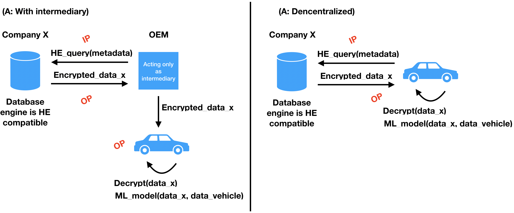
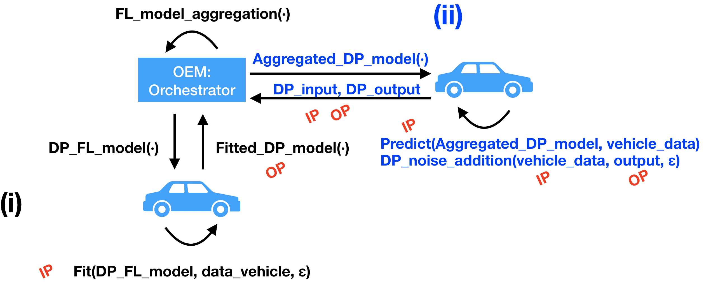

# Privacy Product Specification

An ambitious vision, one which encompasses all from this course and more, is that of having an **end-to-end trust-less privacy-preserving data market with self-sovereign identities**.  
There is a lot of condensed information in this statement and it is beyond the scope of this project. I will instead develop a concept that has some of the components of this vision in the context of the **automotive industry**, and more precisely, in the context of drivers and their vehicles. 

Disclaimer - This piece of writing contains exclusively my own thoughts and opinions. No other entity or body is responsible for the content of this piece of writing. 

Note to the reviewer: I think the word choice for this project is slightly wrong. You are asking for a product, but there is no value in thinking about e.g. packing differential privacy with SQL. Looking at your questions, I think you guys mean an architecture, or a concept, where you find the information flows and then you include the privacy-enhancing technologies, inter alia.

#### Acronyms

PET - Privacy enhancing technology
DP - Differential privacy
HE - Homomorphic encryption
SMC - Secure multiparty computation
FL - Federated learning
ML - Machine learning
DP-SGD - Differentially private stochastic gradient descent (for deep learning (DL))
PKC - Public key cryptography
ZNP - Zero knowledge proofs
TEE - Trusted execution envisonments, or secure enclaves
BC - Blockchain
ST - Structured Transparency
IP - Input privacy
OP - Output privacy
IV - Input verification
OV - Output verification
FG - Flow governance
IFLow - Information flow
OEM - Original Equipment Manufacturer, in this project's context an automaker

## 1. Goal

1. Solve a real-world problem with Private AI in a viable way: Points 2, 3, 4.
2. Make a compelling value proposition: Point 4.
3. Compare and show progression from existing technologies: Point 7.
4. Show a clear audience and viable use cases: Point 3.
5. Describe the product within the structured transparency framework: Point 6.

## 2. Problem statement

Data across industries and companies are siloed. A product could enhance its value to customers through the use of data outside the domain of the product. E.g., a vehicle could use the data from a smartwatch to assess whether a person is in good condition for driving, or it could use the data from Netflix to recommend a podcast that talks about the intricacies of the film you watched yesterday (Like the mind-numbing [Tenet](https://en.wikipedia.org/wiki/Tenet_(film)). However, this is impossible today. Large corporations are reticent to let the data they collect be accessed from outside of their organizations, because of regulatory reasons (fear of a backlash), and for fear of the competition.  
Partly, fear of competition in terms of data is derived from other corporate matters which indeed need to be kept secret, like trade secrets. Data, however, are enriched when put together with more data. In this sense, when companies restrict access to data for fear of the competition, they are also missing opportunities to extract yet more value. While this fear is justified, e.g. the weights of in-house ML models are intellectual property, there are ways to circumvent these cases with PETs, and simultaneously, avoid the hammer of justice.  
By developing a privacy-preserving architecture to comply with the needs of the corporations involved in IFlows, we can unlock the value of their products and services and the life of their customers.  

Note for the reviewer: This problem statement is quite general, but I think (From the feeling I got from the course) that developing a modular and extendible concept, its building blocks, is more instructive than going into the nitty-gritty of thinking about how do I connect a customer's Netflix history to the infotainment of a vehicle. I think that is more suitable for future technical courses.

## 3. Product

### 3.1 Description
The concept consists of a series of products that enable a customer to share any of his/her devices' data with his/her vehicle so that the driving experience is improved.

### 3.2 Use cases
With such a concept, the limit for use cases in your imagination, here are some you could accomplish with such an architecture:

(A) Merging the driver's data from other sources: 
1. The vehicle can recommend points of interest as you drive by them based on data from your smartwatch. 
2. A podcast is played based on your Netflix recently watched movies. 
3. The inside lightning of the vehicle is changed based on the mood of the movies you have been watching.

(B) Merging the driver's data with other drivers' data.
4. An eco-friendly driving score is displayed based on your driving behavior.
5. Predictive maintenance of vehicle parts. 
6. Monetary valuation of your vehicle.

All of this without revealing anything from the individual to the automaker, Netflix, or whatever other company.

### 3.3 Target audience

Any person who is using a vehicle. A simpler architecture would be one targeted to vehicle owners; a more complicated architecture would be one where the services described in 3.2 would need to be given if the person uses vehicles he/she only leases for short periods of time. I focus on the former architecture. 

## 4. Value proposition (Why?)

By implementing the components of this concept, we are able to create new user experiences for drivers that before did not exist. If you are an OEM implementing this concept, then the vehicle you manufacture has qualities that no other vehicle would have.

## 5. Information flows 

There are different IFlows depending on if we are offering (A) or (B) from Point 3.2.

(A)

There is an IFlow between the database from company X to the OEM, or directly to the vehicle V.
Data from X, or the necessary insights, travel to the OEM or V, and the OEM or V transform it into a service for the driver. In the further future, data from X could be funneled directly to V, but it is more realistic to consider the Iflow: X-OEM-V. Of course, the origin of the data was the actions of the person using the services from X. 

(B)

There is an IFlow between the driver's vehicle V, other drivers' vehicles Vs, and the OEM. I could consider a holistic IFlow like Vs-OEM-V. The origin of the data was the driving behavior and actions of the driver using the vehicle V. 

## 6. Structured transparency 

### Defintions of components mapped to the corresponding PET

Input privacy (IP): Create IFlow between multiple parties while keeping the inputs secret.  
Output privacy (OP): Allows to disperse outputs containing some information without accidentally revelaing other information that should be kept hidden, like the input or the sender of the input.  
Input verification (IV): Allows you to verify the content, integrity and origin of an IFlow without revealing additional information. Possible to verify that an IFlow was constructed by specific holders of specific keys that we deem trustworthy. It can also be used to verify that transformations within the IFlow ocurred as it was suposed to.  
Output verification (OV): Verifies attributes about what is happening to the hidden IFlow itself. Allows for properties of an IFlow to be verified without revealing the exact transformation happening within an IFlow.  
Flow governance (FG): It is satisfied if each party with concern about how that information could be misuse, has the ability to prevnet an IFlow to be changed. All parties would need to agree to change the IFlow in that way. Sets rules so that nothing about the integrity about the other four components is compromised.

### (A)

Input: Data from a company external to the OEM. E.g. Netflix, Google, Apple, etc. And some data from V as well. 
Processing: ML model to match an in-vehicle service with input data.  
Output: Service, e.g. music, podcast, POIs, etc.

Entities:  
Any corporation, whose possible motivation is to keep a customer engage with their product beyong their product.   
OEM, whose motivation is to enhance the customer experience.  
Driver (V), whose motivation is to maximize his/her driving experience. 

#### 1 Input privacy

There are three parties involved, one of them being the customer and the other two companies. In this case, the OEM needs to know what to fetch from company X so that it can offer the service to the driver (V). I can argue that while the OEM knows what is fetching, it may not know the content of what it is fetching. And company X should not know what has been fetched.

I could take it a step further, where the driver (V) selects which data he/she wants to fetch, and the OEM would also not know about these metadata and would blindly but correctly query the data from company X. However, from the author's experience, customers in many types of products do not want to worry about these things, so we could leave an option for it, but realistically, the customer will not spend the time on these matters. Furthermore, the OEM is the entity that precisely knows which services the vehicle can offer. Thus, the architecture must be seamless and it is the responsibility of the OEM and of company X to perform the actions correctly and lawfully abiding. 

To be extremely privacy-preserving, one may argue that the OEM should also not know which driver is been serviced. In this case, we could use some sort of scrumbler, where a middle trusted SW is matching drivers with services and the OEM only provides the computation to attain those services without knowing to whom it is directed. However, the OEM knows the person has purchased a vehicle, so it is a given the person is using the vehicle, and therefore, the services within the vehicle. The OEM, according to what I have chosen in Point 7, while it knows the vechicle it is serving, the OEM does not know the output of the service. Furthermore, given the technologies chosen in Point 7, Company X would never know which driver (V) is.  

In summary:  
Company X does not know which data is being fetched and for who.  
OEM only knows the metadata, so it can create the right query.
Driver (V) technically knows the input.

#### 2 Output privacy

The output of the query must only be known by the driver (V), it is kept hidden from company X and the OEM. How is it kept hidden? See Point 7.   
In order for the OEM to learn from the output of the algorithm to train future algorithms, then more PETs must be applied, this however is the domain of case (B).

### (B)

(i) Training phase:
Input: Data from vehicles from multiple drivers.  
Processing: ML model that trains on multiple drivers' data.  
Output: Fitted model.

(ii) Prediction phase (Offering a particular service, e.g. an eco-driving score):
Input: Data from any vehicle.  
Processing: ML model to assess driving behavior, provide statistics, or other predictive maintenance services of a single driver.  

Entities:  
OEM, whose motivation is to enhance the driving experience.  
Drivers, whose motivation is to maximize their driving experience or the value of the vehicle. 

#### 1 Input privacy

(i)  
The input from the drivers must be kept hidden from the OEM, thus it either is encrypted and sent to an environment where the computation is still private, or it is performed on-premise, i.e. in the vehicle. I assume that the vehicle has the resources to compute the algorithm itself, therefore, as long as the input does not leave the vehicle, we comply with IP.

Furthermore, following the logic explained for the concept (A), the OEM knows a person has purchased a product, and that some users have given consent to participate in this service, therefore, it is not necessary to cloak the individual identities in (i).

(ii)  
There are two possibilities here. Once the model has been trained, it can be sent to vehicles to be executed on its data (On-premise), complying therefore with IP. The other option is to send data from the vehicle to the OEM, so the model is executed centrally and the response (service) is sent back to the vehicle. The latter however would require a PET to make sure the input is hidden, which further complicates the process and reduces the accuracy. Therefore, we select the former approach.

#### 2 Output privacy

(i)  
The fitted model is the output of the process in this part, would the fitted model leak information about the input? Yes, it would, as it has been proven by e.g. Dawn Song. Therefore, there needs to be a PET applied to the training or to the output model so that nothing is learned about the input.

(ii)  
The prediction can simply stay in the car, and therefore, there is no need for any PET. However, if the OEM would like to learn what were the results of the execution of the ML model, then the vehicle could submit the input and its output to the OEM in a private manner.

### Input and output verification

In an ideal world, I believe, most of what hat is done digitally should be accompanied by a digital certificate that can verify the origin, the end-point, the content, or any intermediate step (Even if it is an anonymous entity, this one also needs to be sustained across time). Otherwise, we solely rely on trust, which sometimes is fine, but it was clearly not enough for e.g. HTTP, it evolved into HTTPS when it was possible.  
While in this use case I can assume that the drivers trust the companies whose products he/she is using, which is fairly valid, when computation allows, we could add proofs to every step of the process, making it trust-less.  
This applies to any step of both (A) and (B).

### Flow governance

In the case of (A) or (B), we do not need a BC to enforce a distributed governance or any other fancy technology. Each user can provide consent for his/her data to travel from one company to another, and companies must abide by the law and only do what the customer dictates. The job of this concept's architecture is to ensure that we obtain the needed transparency while preserving the customer's privacy across companies, which is rare in today's world.  
Someone may think that storing all the data in the car is a great empowering idea, but a vehicle, and more so when these become autonomous, potentially produces TB of data. So there is an entity that needs to store the data for the customer, how it is stored to comply with GDPR, or HIPPA, etc. is a matter of IP and OP.  
The involved companies have the responsibility to ensure that the other four components of ST are always met.  
This paragraph addressed (A) more than (B), however, the same principles described apply to (B).

## 7. Technologies and their progression/maturity to perform

### Mapping of components, problems and technologies.

IP solves the copy problem, via PKC, HE, SMC, or DP. 
OP solves the bundling problem, via DP.
IV solves the bundling problem, via HTTPS, active security added to HE and SMC, and ZNPs. 
OV ensures that the output has been correctly obtained, via ZNPs. 
Distributed governance as a FG policy solves the recursive enforcement problem.

There are other PETs not mentioned in the course:  
Syntactic anonymization techniques, like K-anonymity and its cousins, which while they do not provide a formal guarantee, are simpler and help with OP.
BC could be used to architect systems of distributed consensus, which support FG.
And TEEs offer confidential compute to keep secret any computation, which supports IP or OP, as anything going in and out of the TEE is encrypted.
FL offers training of ML models on premise. I will use in this concept centralized FL (CFL), where a central server orchestrate the process. CFL solves IP, as the central server does not need to see the input.

Note that technologies such as HE, SMC, ZNP, and TEE are still maturing and do not perform efficiently in production settings yet. - *Please correct*

### (A)

#### 1 Input privacy

Fetching data from company X by the OEM; only the OEM knows the metadata:    
Here, I have three options: HE, SMC, or TEE. For any of them to happen, obviously, company X and the OEM must maintain an execution environment for external queries and managing responses respectively. Company X would charge, in this case to the OEM, for fetching the data.  
The OEM could make a HE or SMC query to company X, or interact with TEEs. All of these technologies are still maturing. TEE is used to perform small computations related to confidentiality or integrity, e.g. authentication, payments, or digital rights management. The larger the code to run in a TEE, the tougher it is to make it secure. A query might not be the best logic to execute given the state of the art (-*Please correct*). SMC and HE are also not mature (-*Please correct*), but given the example given by Pascal Pallier, where they found a passport number in a dataset using HE, in this concept architecture, we will run the query in a HE manner, even though it is a loose reason. This way, both inputs are not known. The public key used for the encryption belongs to the driver (V), so only the driver can decrypt the output.  
Furthermore, SMC requires a lot of messages sent back and forth between the two parties involved. While this should not be a problem between two companies, if in the future the car is the one that takes decisions and computes by itself, perhaps SMC is not entirely suitable, as a vehicle might have a poor network connection in some areas. 

Technology used: HE.

#### 2 Output privacy

Company X provides the data to the OEM without neither of them knowing the content, as the process has been HE.  
Following the previous point about IP: HE's input and output are encrypted, therefore neither company X nor the OEM knows about the input (Metadata for the query to work), or the output (Data from company X related to the driver). However, the OEM must use a public key that belongs to the driver, so that the output of the HE execution cannot be decrypted by the OEM, only by the driver, i.e. the vehicle. This might be a key management nightmare, but let us assume it is possible and that the vehicle has a private key and the corresponding environments within the vehicle to execute what is necessary next for this concept.

The output of the query is private given HE. But now, we must process the output of the query combined with the data from the vehicle itself with an algorithm. If this process is done on-premise as I just mentioned above, i.e. in the vehicle, then there is nothing more to worry about. If the vehicle does not have enough resources to execute the algorithm and thus needs e.g. a cloud server, then we are looking again into TEE, HE, or SMC. The choice I would make for this case would be HE, although algorithms like ML probably perform poorly under HE. So, for the sake of this concept, let us stick to the former proposition, the algorithm is performed on-premise and thus, we do not need any technology for OP beyond the query output. Moreover, I further assume that the data needed from the vehicle is available on-premise as well; if it were somewhere else, then this should be encrypted, fetch only the necessary data, and forward to the vehicle for the execution of the algorithm. This corresponds to the concept (A) with an intermediary, see figure.

If we take the concept a step further, I could see a future where it is the SW from the vehicle that contains the logic to trigger all these steps, instead of only triggering the logic hosted in the cloud owned by the OEM that cascades in all the described steps. This paradigm would couple nicely with autonomous vehicles. This corresponds to the concept (A), decentralized.

See the figure depicting a summary, it contains two possible high-level architectures. Another interesting question is: Who is paying for querying company X?

Technology used: No need for a PET. The model is executed locally.

**This concept has a lot of simplifications, and given the state of the art of HE, any real implementation would stay in PoC phase. Concept (B), however, is more realistic.**

### (B)

#### 1 Input privacy

(i)  
The model is sent to the vehicle, therefore, there is no need to apply any PET at this step of the process. The PET that allows us to train a model individually is FL. We send a model to each vehicle, where it is trained locally. Then the OEM acting as an orchestrator, aggregates the fitted models, obtaining a final model that can be employed for predictions.

Technology used: FL.

(ii)  
To obtain the service from the OEM, the OEM can send the fitted model to the vehicle, where it is run locally, so the input to the model may be maintained hidden.

Technology used: No need to use a PET.

#### 2 Output privacy

(i)  
The output is the fitted model, and to make it privacy-preserving, we need to employ a PET, lest it leaks information from the input. We can use DP during the training of the FL model, this technique is called DP stochastic gradient descent (DP-SGD). However, I must carry out more research on how DP is integrated in a federated manner.

Technology used: DP + FL. Which refactors the technology presented in the previous section (B) IP (i).

(ii)  
Equally to IP, to obtain the service from the OEM, the OEM can send the DP fitted model to the vehicle, where it is run locally. Therefore, the output would also be maintained hidden. However, as it has been mentioned in Point 6, the OEM may also like to learn what has been the outcome of the training, the vehicle could share the input and output of the model using DP. This way, both the input and output are protected.

Technology used: No need to use a PET, however, for sending back the input and output, we use DP.

If the OEM does not want to send the aggregate model to the vehicle for fear of misappropiation of intellectual property, then the vehicle could send DP data to the OEM as input, the OEM would run the aggregated model centrally, and then it would send the output to the vehicle. The OEM would not need to take extra measures for hiding the output, because this one is already DP, because the input was DP.

You may find a summary of the concept (B) in the following figure.

### Input and output verification

Following the logic from Point 6 "Input and output verification", if computation allows and the technology is advanced enough, I would add to our concept ZNPs. Of course, PKC is a given in any internet-based application for IV.
ZNP supports OV, as it can prove that a computation within the IFlow of interest has been done correctly.  
To the best of the author's knowledge, while ZNPs are advancing, they are still not widely used due to performance issues. - *Please correct*.

## 8. Extant products or state of the art

We have chosen three technologies to realize our concept (HE, FL, and DP), here is some gray literature about what is the maturity level of the technologies.

About HE:  
Snippet from an [IBM blog post](https://www.ibm.com/blogs/research/2018/03/elegant-disgusting-cryptography/) of 2018: “Computing on encrypted data is probably still 10,000 times slower than standard computation today where the data is in the clear, but this is already acceptable for some niche applications, and we are making steady progress on speeding it up,” says Halevi.  

About DP in the wild: [Apple](https://www.apple.com/privacy/docs/Differential_Privacy_Overview.pdf) uses DP in your phone. The epsilons are for me quite arbitrary, Apple does not provide any explanation about their value. But the cool thing is that you can actually go to your phone and find out. Go to Settings-Privacy-Analytics & Improvements (bottom) - Analytics data. Look for a file with the name differential privacy. Sometimes I find one, sometimes I do not, I guess it depends on what one uses and one's settings.

About FL: [Google](https://ai.googleblog.com/2017/04/federated-learning-collaborative.html) is researching its application in phones, with promising results.

In summary, as mentioned in this document. HE is still far from being production-ready, but we can already see FL and DP in the wild.

## 9. Final remarks

Concept A has a lot of simplifications, and given the state of the art of HE, any real implementation would stay in PoC phase. Concept (B), however, is more realistic. FL is in use at the moment in our phones. Furthermore, considering DP, while there is still a lot to do in terms of global privacy budgeting, it is computationally inexpensive.
Looking back at the concepts, I would perhaps rethink concept (A) with some of the features from concept (B), as the latter is more feasible.

## Target questions

### What are the information flows involved in your product? 
See point 5.

### Who governs these flows and how?
See point 6.

### For each flow, does it need input privacy and/or verification? Does it need output privacy and/or verification? Give details.
See point 6.

### What tools are used to achieve input privacy and output privacy if necessary?
See point 7.

### Value proposition, what value do users gain from your product
See point 4.

### Comparison to existing technology/products, with a focus on how input or output privacy makes your product better
See point 8.

### Use cases, how would people use your product
See point 3.

### Your audience, who would use your product
See point 3.